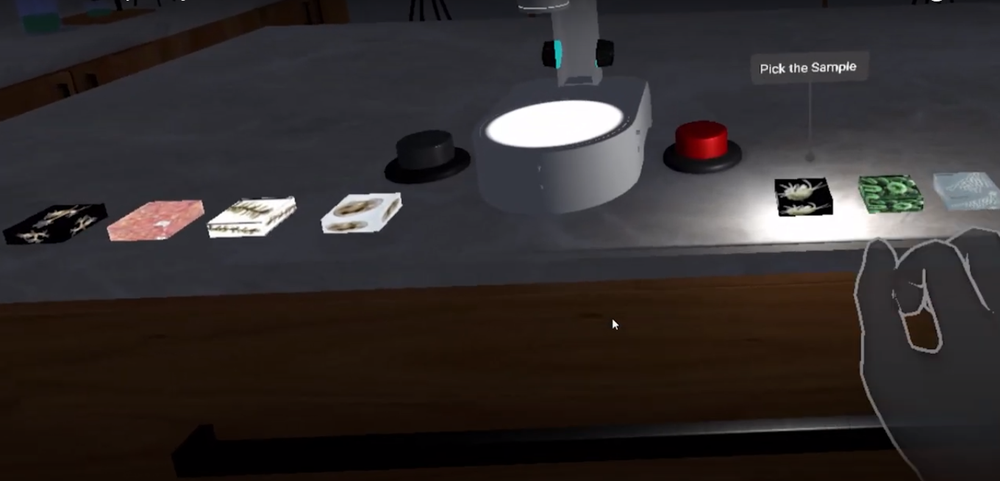
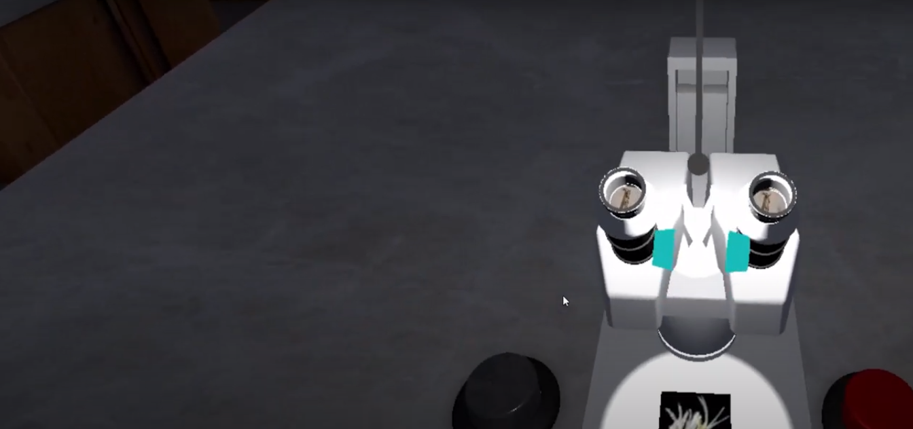
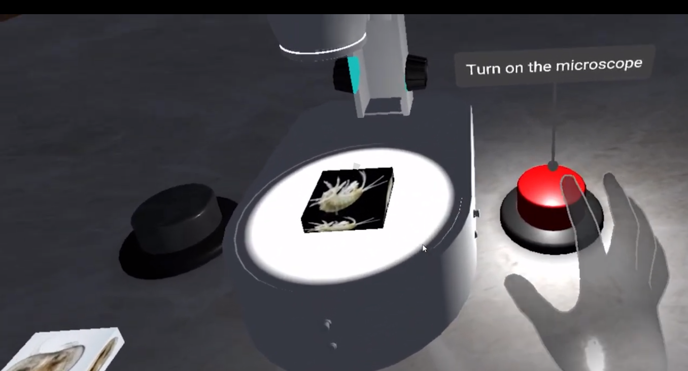

# VR Microscope AR Experience

**Discover a new dimension of learning with our Microscope AR experience. Explore the microscopic world in augmented reality, offering an interactive and educational journey right from your device, brought to you by MicroscopeAR Studio.**

## 📌 Table of Contents

1. [About the Project](#about-the-project)
2. [Microscope AR Details](#microscope-ar-details)
3. [Installation](#installation)
4. [Usage](#usage)
5. [Contribution](#contribution)
6. [License](#license)
7. [Contact](#contact)
8. [Acknowledgements](#acknowledgements)

## 🔬 About the Project

VR Microscope AR Experience is not just another app; it's a groundbreaking educational tool that takes you on a journey into the microscopic world through augmented reality. Explore cells, organisms, and more with interactive and immersive AR experiences designed to enhance your learning.

## 🌐 Microscope AR Details

### Description

- **Augmented Reality Learning**: Interact with microscopic objects in your real-world environment using augmented reality.
- **Educational Exploration**: Discover and learn about cells, organisms, and other microscopic entities through engaging experiences.
- **Immersive Interactions**: Use gestures and touch to interact with AR objects and access information.

### Key Features

- **Educational Augmented Reality**: Learn in a new and exciting way with augmented reality-enhanced lessons.
- **Interactive Learning**: Engage with AR models and quizzes to deepen your understanding.
- **Accessible Learning**: Access the microscopic world right from your device, making learning convenient.

### Gallery

## 💻 Installation

**Follow these instructions to experience VR Microscope AR:**

1. **Requirements**
   - Smartphone or tablet with AR capabilities
   - Download the VR Microscope AR app from your device's app store.
2. **Setup**
   - Launch the app and explore the microscopic world in your own surroundings.

## 📚 Usage

**Here's how to get started with VR Microscope AR Experience:**

1. Open the app and select an AR experience or topic you want to explore.
2. Use your device's camera to scan your surroundings.
3. Interact with AR objects by tapping, pinching, or swiping.
4. Learn and discover the microscopic world through immersive AR experiences.

## 🤝 Contribution

We welcome contributions from the educational and AR communities. If you'd like to contribute, please fork the repository and create a new pull request.

## 📄 License

Distributed under the XYZ License. See `LICENSE` for more information.

## 📞 Contact

XREV Studio
- Email: contact@xrevstudio.com
- Twitter: [@XREVstudio](https://twitter.com/MicroscopeAR)

## 👏 Acknowledgements

- [ARCore](https://developers.google.com/ar)
- [ARKit](https://developer.apple.com/augmented-reality/ARKit/)
